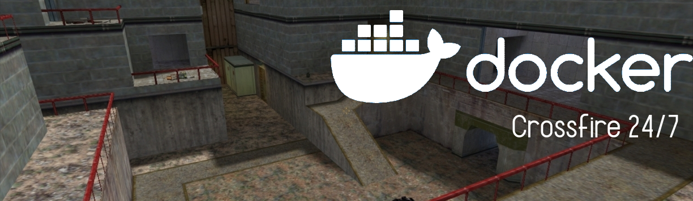

[](https://github.com/jjsalinas/hl-server/actions)
[](https://hub.docker.com/r/josejsalinas/hl-server)





# HLDS Docker dproto(47/48 Steam+noSteam) - Crossfire 24/7

## Half-Life Dedicated Server as a Docker image

Probably the fastest and easiest way to set up an old-school Half-Life
Deathmatch Dedicated Server (HLDS). <br>
Both Steam and noSteam, old and new half-life clients can connect and play together!<br>
You don't need to know anything about Linux or HLDS to start a server. You just need Docker and
this image.

## Repository

This project is a fork of: [artkirienko/hlds-docker-dproto](https://github.com/artkirienko/hlds-docker-dproto)

## Quick Start

#### Docker Hub Image

The latest image of this repo is available in docker hub [josejsalinas/hl-server](https://hub.docker.com/r/josejsalinas/hl-server) 🐋
 
```bash
# To quickly run the image
docker run -it --rm -d --name hl-server -p27015:27015 -p27015:27015/udp josejsalinas/hl-server +map crossfire +maxplayers 12
```

#### Locally

Build the image `hl-server`:

```bash
docker build -t hl-server .
```

Run your image 
```bash
docker run -it --rm -d --name hl-server -p27015:27015 -p27015:27015/udp 
```

You can add extra parameters when starting the image
```bash
docker run -it --rm  --name hl-server -p27015:27015 -p27015:27015/udp hl-server +map crossfire +maxplayers 16 +password 1 +vs_password "password"
```

> **Note:** Any [server config command](http://sr-team.clan.su/K_stat/hlcommandsfull.html)
  can be passed by using `+` after the docker command options.

  #### Customization
  
  Adjust things as you like in `default.cfg` file to set them to your liking.
  Like `hostname` to set your server name, or `sv_password` to set a password.

## What is included

* [HLDS Build](https://github.com/DevilBoy-eXe/hlds) `7882`. This is the last
  known version that is compatible with last version of **dproto** that's `0.9.582`

  ```
  Protocol version 47/48
  Exe version 1.1.2.2/Stdio (valve)
  Exe build: 17:23:32 May 24 2018 (7882)
  ```

* [Metamod-p](https://github.com/Bots-United/metamod-p) version `1.21p38`

* [AMX Mod X](https://github.com/alliedmodders/amxmodx) version `1.8.2`

* **dproto** version `0.9.582`. This is the last version of **dproto**,
  the project is abandoned.

* Patched list of master servers (official and unofficial master servers
  included), so your game server appear in game server browser of all the clients

* Minimal config present, such as `mp_timelimit` and mapcycle

## Default mapcycle - crossfire 24/7
* crossfire


## Advanced

In order to use a custom server config file, add your settings
to `valve/config/server.cfg` of this project and mount the directory as volume
to `/opt/steam/hlds/valve/config` by running:

```bash
# Using docker hub image
docker run -it --rm -d -p27015:27015 -p27015:27015/udp -v $(pwd)/valve/config:/opt/steam/hlds/valve/config josejsalinas/hl-server
```
