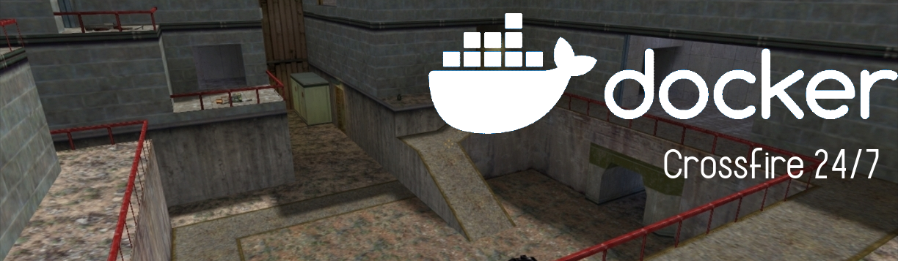

[](https://hub.docker.com/r/josejsalinas/hl-server)


[](https://github.com/jjsalinas/hl-server/actions/workflows/docker-publish.yml)
[](https://hub.docker.com/r/josejsalinas/hl-server)




# HLDS Docker - Crossfire 24/7

## Half-Life Dedicated Server as a Docker image

Probably the fastest and easiest way to set up an old-school Half-Life
Deathmatch Dedicated Server (HLDS) running Crossfire map 24/7 with 15-minute rounds.

You don't need to know anything about Linux or HLDS to start a server. <br/>
You just need Docker and this image: https://hub.docker.com/r/josejsalinas/hl-server

## Features

- 15-minute rounds with automatic map cycling
- **Crossfire map only**
- Customizable server settings via `.env`
- Auto-restart on crash
- **MetaMod + AMX Mod X 1.9 installed**
- Built-in `timeleft` command (type in chat to see remaining time)
- Admin commands ready

## Quick Start

#### Docker Hub Image (Recommended)

The latest image of this repo is available in docker hub [josejsalinas/hl-server](https://hub.docker.com/r/josejsalinas/hl-server)

```bash
docker run -d --name halflife-server \
  -p 27015:27015 \
  -p 27015:27015/udp \
  -e SERVER_NAME="My Crossfire Server" \
  -e MAX_PLAYERS=16 \
  -e RCON_PASSWORD=changeme \
  josejsalinas/hl-server:latest
```

Or use docker compose with the hub image by creating a `docker-compose.yml`:

```yaml
services:
  halflife:
    image: josejsalinas/hl-server:latest
    container_name: halflife-server
    restart: unless-stopped
    ports:
      - "27015:27015/tcp"
      - "27015:27015/udp"
    environment:
      - SERVER_NAME=${SERVER_NAME:-Half-Life Crossfire Server}
      - MAX_PLAYERS=${MAX_PLAYERS:-16}
      - SERVER_PASSWORD=${SERVER_PASSWORD:-}
      - RCON_PASSWORD=${RCON_PASSWORD:-changeme}
      - WELCOME_MESSAGE=${WELCOME_MESSAGE:-Welcome to Crossfire!}
```

#### Build Locally

Build the image yourself:

```bash
docker compose build
```

Run your server:
```bash
docker compose up -d
```

That's it! Your server is now running on port 27015.

## Configuration

Edit the `.env` file to customize your server:

```bash
cp .env.example .env
nano .env
```

| Variable | Description | Default |
|----------|-------------|---------|
| `SERVER_NAME` | Server name shown in server browser | Half-Life Crossfire Server |
| `MAX_PLAYERS` | Maximum number of players | 16 |
| `SERVER_PASSWORD` | Password to join server (leave empty for public) | (empty) |
| `RCON_PASSWORD` | RCON admin password | changeme |
| `WELCOME_MESSAGE` | Message shown when players join | Welcome to Crossfire! Fight until the last player stands! |

### Example Configuration

```env
SERVER_NAME=My Awesome Crossfire Server
MAX_PLAYERS=20
SERVER_PASSWORD=secret123
RCON_PASSWORD=adminpass456
WELCOME_MESSAGE=Welcome! 15-minute Crossfire rounds!
```

## What is included

* [HLDS Build](https://github.com/EXORTEM/hlds) `7882`. Stable version compatible with MetaMod and AMX Mod X.

  ```
  Protocol version 48
  Exe version 1.1.2.2/Stdio (valve)
  Exe build: 17:23:32 May 24 2018 (7882)
  ```

* [Metamod-P](https://github.com/Bots-United/metamod-p) version `1.21p38`

* [AMX Mod X](https://www.amxmodx.org/) version `1.9` (latest stable)

* Minimal config with 15-minute rounds and Crossfire map only

* Customizable via environment variables

## Default mapcycle - crossfire 24/7
* crossfire

## Advanced

### Custom Server Configuration

In order to use additional custom settings, you can modify `server.cfg` before building, or:

1. Enter the running container:
```bash
docker exec -it halflife-server bash
```

2. Edit the config:
```bash
nano /opt/steam/hlds/valve/server.cfg
```

3. Restart the server:
```bash
docker compose restart
```

## License

This configuration is provided as-is for running Half-Life dedicated servers.
Half-Life is a trademark of Valve Corporation.
